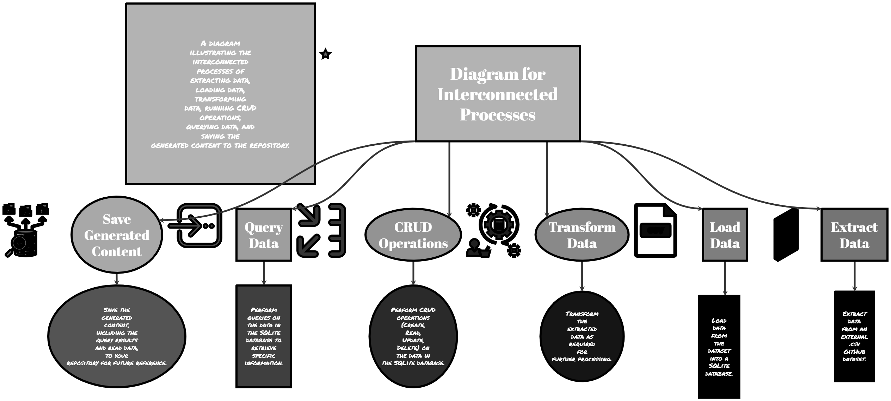

# SQLite Project | Load, Transform, Query, and run CRUD operations on Data

This project demonstrates a robust data pipeline using SQLite, encompassing data loading, transformation, querying, and CRUD (Create, Read, Update, Delete) operations. The project is set up to run Continuous Integration and Continuous Deployment (CI/CD) pipelines, automating various database operations with each push to the repository. Additionally, it provides the flexibility to execute queries via the command line interface (CLI) with optional query output, allowing for efficient data analysis and management.

## Features

- Load external data into an SQLite database.
- Transform and clean data for analysis.
- Execute SQL queries for data analysis.
- Implement CRUD operations (Create, Read, Update, Delete) for database records.
- Automate data pipeline operations with CI/CD.

## Usage

### Running the Pipeline

To execute the data pipeline, follow these steps:

1. Clone the repository to your local machine.
2. Navigate to the project directory.
3. Run the data pipeline using in the main.py script with or without the --query flag on the CL the appropriate command.

### Executing Queries

The project allows you to execute SQL queries and view the results. You can use the `--query` flag followed by your SQL query to include the query result in the output.

This command will execute the specified SQL query and display the result.

## CI/CD

The project is set up with Continuous Integration and Continuous Deployment (CI/CD) pipelines. With each push to the repository, the following operations are performed automatically:

1. Data loading into the SQLite database.
2. Data transformation and cleaning.
3. SQL queries execution.
4. Logging the output of the operations.

The output of the operations, including any query results and CRUD actions, is automatically saved to the `output.txt` file for reference.
